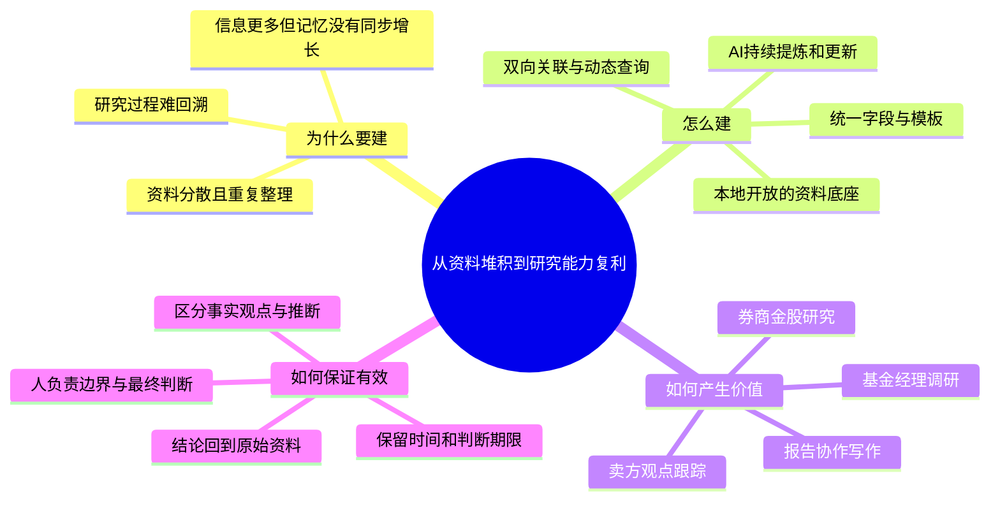

> 根据东吴证券研究所《AI 研究系列之四：AI + Obsidian 管理投研知识库》整理  
> 适用场景：内部分享、研究方法交流、知识管理主题演讲  
> 建议时长：15-20 分钟

## 全文框架

整篇报告的逻辑可以压缩成一句话：**AI 负责提高资料处理速度，知识库负责保存上下文、关系和演化过程，研究者负责事实核验、结论强度与最终判断。**

---

## 一、问题不在信息不足，而在研究过程没有沉淀

投研工作每天都会接触公告、研报、调研纪要、论文、网页文章和市场观点。过去的主要矛盾是资料难找；有了大模型以后，摘要、归纳和初稿都可以快速完成，新的矛盾变成了：**处理过的信息越来越多，真正能够长期记住、再次调用和继续推演的内容却没有同步增加。**

常见问题有四个：

1. 资料散落在浏览器收藏夹、PDF、Word、Excel、聊天记录和会议系统里，存下来了，却没有形成连接。
2. 一次 AI 对话结束后，问题背景、引用依据、修改过程和判断边界也随之中断。
3. 面对新课题时，研究者仍要重新搜索、重新阅读、重新拼接，过去的劳动没有转化为可复用资产。
4. 观点会随时间变化，但普通文件夹只能保存结果，很难回答“谁在什么时候、基于什么材料、如何改变了判断”。

因此，知识库的目标不应只是“多存资料”，而应让每一次阅读、调研和写作都留下可以继续使用的结构化成果。

## 二、核心转变：从一次性问答转向持续维护的 LLM Wiki

报告借用了 Andrej Karpathy 提出的 LLM Wiki 思路，并把它与传统 RAG 做了区分。

传统 RAG 的工作方式是“提问后再检索”：每次收到问题，系统从原始文档中临时找出相关片段，再组合成回答。它适合即时问答，但复杂问题往往需要反复寻找和拼接同一批材料，知识并没有真正积累下来。

LLM Wiki 的工作方式更接近“预先整理、持续维护”：

- 从新资料中提取人物、机构、主题、资产和观点；
- 新建词条，或更新已有页面；
- 把新增材料与既有内容建立关联；
- 标记不同来源之间的矛盾与分歧；
- 根据新证据修订原有总结，并保留回到原文的路径。

Karpathy 用了一个很形象的比喻：**知识库是 IDE，LLM 是程序员，Wiki 是不断演化的代码库。** 对投研而言，这意味着 AI 不再只负责回答眼前的问题，而是参与一套长期存在的研究工程。

## 三、一个有效的投研知识库，需要四层结构

### 1. 资料层：先保留原始证据

网页、报告、公告、论文和调研纪要首先要进入统一资料池，并保留来源、发布日期、采集日期和原文链接。原始材料不能被摘要替代，因为摘要省略了什么、是否误读了上下文，都必须回到原文才能核验。

### 2. 结构层：用统一字段形成可比较的研究对象

不同类型的研究笔记需要不同字段，但基本设计应围绕“谁、何时、研究什么、作出什么判断、依据是什么、有效到什么时候”。报告中的典型字段包括：

| 内容类型 | 建议保留的核心字段 |
| --- | --- |
| 网页与报告 | 类型、来源、发布日期、采集日期、主题、项目、摘要 |
| 卖方观点 | 机构、日期、主题、观点方向、原始报告、观点卡片 |
| 券商金股 | 券商、股票、行业、产业主题、推荐月份、推荐状态、投资逻辑、事件催化 |
| 基金经理调研 | 基金经理、基金公司、调研日期、行业主题、资产类别、观点方向、判断期限、原始纪要 |

字段的价值不在“格式整齐”，而在于让原本不可比较的文字材料能够按时间、主体、主题和方向重新组合。

### 3. 关联层：从目录结构升级为研究网络

文件夹回答“资料放在哪里”，关联关系回答“这条信息与哪些行业、公司、人物、事件和历史判断有关”。一份纪要可以同时连接基金经理、港股、AI 产业链和某次市场判断，不必被迫只属于一个目录。

关系图谱适合检查知识结构、发现孤立资料和遗漏连接，但报告也明确提醒：**链接多不等于内容重要，孤立笔记也不等于价值低；图谱展示的是已经建立的关系，而不是全部语义关系。** 所以图谱是结构检查工具，不是内容价值评分器。

*图8-9展示的是已建立链接的可视化结果。读图时应关注结构与遗漏，不应以节点大小或连接数量直接判断内容价值。*

### 4. 应用层：查询、比较、写作与更新

当原始资料、结构化字段和关联关系都存在以后，知识库才真正具备应用价值：可以自动形成资料索引和研究看板，可以比较前后两个时间窗口，也可以让 AI 在限定资料范围内搭框架、补充内容和统一文风。

> [!note]
> 一个有效的知识库，是围绕研究问题选择可靠资料，将其中可比较、可检索的信息结构化，建立有研究意义且能回到原文的关联，并在查询、写作和新资料进入的过程中持续修订。
## 四、四个投研场景，说明价值如何落地

### 场景一：把报告写作变成“阅读—修改—检查—重构”

案例以**海外期权型 ETF 研究**为例。研究者先**汇集**行业文章和产品资料，再让 AI **阅读**指定资料范围，**识别** ETF 类型、代表产品、期权结构、收益来源和主要风险；资料不足的地方明确**保留信息缺口**。形成框架后，再对局部段落做改写，最后统一全文风格。

*图20-21展示了AI从局部段落改写延伸到全文风格统一的过程。图中的意义是说明协作方式，而不是证明生成结果可以免于核验。*

这里真正值得借鉴的不是“一键写报告”，而是三条协作边界：

- 只使用指定资料，避免无来源扩写；
- 保留原有判断和资料出处，缺证据就写“现有资料不足以判断”；
- AI 处理大范围、重复性的文字工作，研究者控制事实口径、结论强度和整体结构。

案例中的 Covered Call ETF 也体现了这种严谨性：不能把较高分配率直接等同于总回报，权利金只能提供有限的下跌缓冲，上涨空间还可能因期权结构受到限制。换句话说，知识库不仅要保存结论，还要保存结论成立的条件。

### 场景二：从“看过卖方观点”变成“跟踪观点变化”

报告选取四个卖方策略团队，将报告原文、观点卡片和主题词表关联，形成动态看板。它回答三个层次的问题：

1. 当前共识是什么；
2. 哪些方向存在机构分歧；
3. 单家机构的观点是否出现边际变化。

#### 图26怎么看？

| 主线 | 同向/覆盖 | 读图结论 |
| --- | ---: | --- |
| 创新药 | `2/2` | 全部看多，完全一致 |
| 红利 | `2/2` | 全部看多，完全一致 |
| 有色金属 | `2/2` | 全部看多，完全一致 |
| 科技硬件与 AI 产业链 | `3/4` | 三家看多、一家看空，主导方向仍为看多 |

> [!tip] 判断结论
> 四条主线的主导方向均为看多；科技硬件与 AI 产业链只是共识强度相对较弱，不能理解为整体偏空或多空势均力敌。

#### 图26和图27不要混淆

| 图表 | 比较对象 | 回答的问题 | 结论 |
| --- | --- | --- | --- |
| 图26 | 同期的不同机构 | 目前市场共识与分歧是什么？ | 横截面比较 |
| 图27 | 同一机构的前后区间 | 这家机构的观点是否改变？ | 时间变化比较 |

> [!warning] 常见误读
> 图26中“较早看空、较晚看多”的记录来自不同机构，不能据此判断某一家机构由看空转向看多。报告中单家机构的变化案例来自图27：由“关注”转为“略空”，代表立场转向谨慎。

*图26回答“同一时期不同机构怎么看”，图27回答“同一家机构前后怎么看”，两种结论不能互相替代。*

这一场景的价值不只是汇总，而是把“市场上有哪些声音”转化为“共识强度、覆盖机构数、方向变化和原文溯源”。每条汇总结论都能回到观点卡片和原始报告，才具备复核价值。

### 场景三：让券商金股从月度名单变成配置偏好数据库

金股名单本身只告诉我们“推荐了什么”，结构化以后可以继续追问：

- 哪些股票被多家机构共同推荐；
- 哪些行业和产业主题正在形成共识；
- 哪些逻辑正在升温或降温；
- 哪些机构持续强化同一条投资主线。

>[!note]
>这四个问题分别判断共识落在哪些股票、集中于什么主线、正在如何变化，以及这种判断由谁持续推动。

报告给出了四类分析：本月金股总览、卖方共识分析、主题热度变化、推荐逻辑拆解。主题热度示例中，AI 算力从 2026 年 7 月的 83 降至 8 月的 45，而 AI 应用从 7 上升至 18；这类数据可以用于观察**卖方配置偏好和观点演化**，但**不能直接等同于投资收益信号**。

*图33反映的是推荐材料中的主题出现频率及其变化，更接近卖方关注度指标，而不是未来收益指标。*

推荐逻辑拆解则把材料组织成“股票—行业—产业主题—投资逻辑—事件催化—机构”的关系。在电力及公用事业示例中，高股息、降本增效、景气反转和需求增长等逻辑同时出现，说明同一行业的配置判断往往由经营改善、盈利增长和组合防御共同驱动，而不是单一标签。

*图34的重点不只是展示关联图，而是让每只股票能够沿着行业、逻辑、催化与机构逐层回溯。*

### 场景四：让基金经理调研可以纵向跟踪、横向比较

单次调研纪要最容易在会议结束后失去价值。报告提出的结构化方式保留基金经理、日期、主题、资产、方向、判断期限和原始来源，由此支持两类查询：

- 纵向看一位基金经理：其对行业、资产和市场风格的判断如何变化；
- 横向看一个行业或资产：不同基金经理的共识、分歧和有效期限是什么。

*图35以基金经理为中心做纵向回顾，图36以资产为中心做横向比较；两种视角都保留判断日期、期限和原始来源。*

这一设计尤其重要，因为观点不是永久有效的事实。记录“判断期限”和“调研日期”，可以避免把历史语境下的观点直接搬到当前；保留原始纪要链接，则能防止汇总表脱离上下文。

## 五、这套方法真正创造的价值

### 1. 研究过程可追溯

每个结论都带着来源、日期和上下文，能回答“为什么当时这样判断”，而不只留下一个孤立结论。

### 2. 知识可以复用，而不是反复加工

同一份材料可以进入报告写作、主题研究、机构跟踪和历史复盘。资料只采集一次，随后通过不同视图被多次调用。

### 3. 观点变化能够被观察

投研价值常常来自边际变化。统一字段以后，可以比较不同时间窗口，识别从关注到看多、从看多到谨慎，或者主题热度的升降。

### 4. 人机分工更清楚

AI 擅长阅读大量文本、抽取字段、搭建初稿、检查结构和统一表达；研究者负责判断来源是否可靠、信息是否过期、证据能否支撑结论，以及结论应该写到多强。

### 5. 数据和知识的所有权更稳定

以本地、开放文本格式保存，意味着资料不依赖单一在线平台，便于备份、迁移、批量处理和版本管理，也更适合被不同 AI 工具读取与维护。

## 六、内容有效性：哪些已经被证明，哪些仍需谨慎

这篇报告的有效性主要体现在**方法可执行、结构可复核、案例覆盖真实投研流程**，而不是证明某套工具必然提高收益。

| 判断层级 | 可以得出的结论 | 不能过度外推的部分 |
| --- | --- | --- |
| 工作流可行性 | 四个案例展示了资料采集、结构化、查询、写作与回溯可以连成闭环 | 报告没有提供对照实验，无法量化节省了多少工时 |
| 信息组织价值 | 统一字段支持按主体、主题、时间和方向比较 | 字段质量仍依赖录入规范和人工校验 |
| AI 协作价值 | AI 可以在给定资料范围内提炼、改写和维护知识页面 | 不能据此认为生成内容天然准确或完整 |
| 看板与图谱价值 | 适合识别共识、分歧、边际变化和遗漏关系 | 关注热度、链接数量不等同于投资价值或未来收益 |
| 案例代表性 | 覆盖报告写作、卖方研究、金股和基金调研四类高频任务 | 案例以展示为主，部分数据经过匿名或示意化处理 |

报告的来源信息清晰：原报告时间为 2026 年 8 月 19 日，由东吴证券研究所发布，作者为于明明、孙石、吴彦锦；相关公众号内容于 2026 年 8 月 20 日发布。引用具体市场观点和案例数据时，应保留这一时间背景。

## 七、落地时必须守住的四条底线

1. **原文优先。** AI 摘要、观点卡片和看板都只是中间层，关键数据与结论必须回到原始材料核验。
2. **时间有效。** 研究资料、卖方观点和调研判断都有时效性，使用时必须同时查看日期和判断期限。
3. **最小权限。** 第三方插件和外部服务可能读取或修改整个知识库；敏感资料应谨慎接入，启用前做好备份并检查来源、维护状态和权限范围。
4. **人保留最终判断。** AI 可能产生事实错误、遗漏和幻觉，也可能把模糊表述润色成看似确定的结论。事实口径、结论强度和投资判断不能外包。

## 八、建议的建设顺序

不必一开始就设计庞大的分类体系。更稳妥的顺序是：

1. 先选一个高频、边界清楚的场景，例如调研纪要或卖方观点；
2. 统一命名和最少必要字段，保证每条结论都能回到来源；
3. 积累一段时间后，再根据实际查询需求增加主题、标签和关联；
4. 先做简单的列表和对比，再升级为动态看板；
5. 最后引入 AI 批量提炼和持续更新，并建立抽查、备份和版本记录。

这条路径的重点是“边使用、边校正”。知识库的结构应由真实研究问题倒推，而不是为了追求形式完整而提前堆叠大量字段。

## 结语

AI 让信息处理变快，但速度本身不会自动变成研究能力。真正有复利效应的，是把原始资料、判断依据、观点变化和研究过程持续保存下来，并且能够在下一次研究中直接调用。

所以，投研知识库最终要解决的不是“笔记记得漂不漂亮”，而是三个更朴素的问题：**过去看过的东西还能不能找到，过去形成的判断还能不能解释，新出现的信息能不能推动旧结论更新。**

当这三件事能够稳定发生时，知识库才从资料仓库变成研究基础设施，AI 也才从一次性的问答工具，变成真正参与长期研究的协作者。

---

## 演讲提示（可按现场删减）

- 开场用“信息越来越多，真正能调用的却没有同步增加”引出痛点。
- 中段不要讲软件操作，重点讲四层结构和四个案例，每个案例只回答“它解决了什么研究问题”。
- 讲到案例数据时强调“关注度不等于收益信号”，自然过渡到内容有效性与风险边界。
- 结尾回到“可找到、可解释、可更新”三个判断标准，形成闭环。

> 资料来源：东吴证券研究所《AI 研究系列之四：AI + Obsidian 管理投研知识库》，报告日期 2026-08-19。本文为演讲用途的结构化整理，不构成投资建议。
